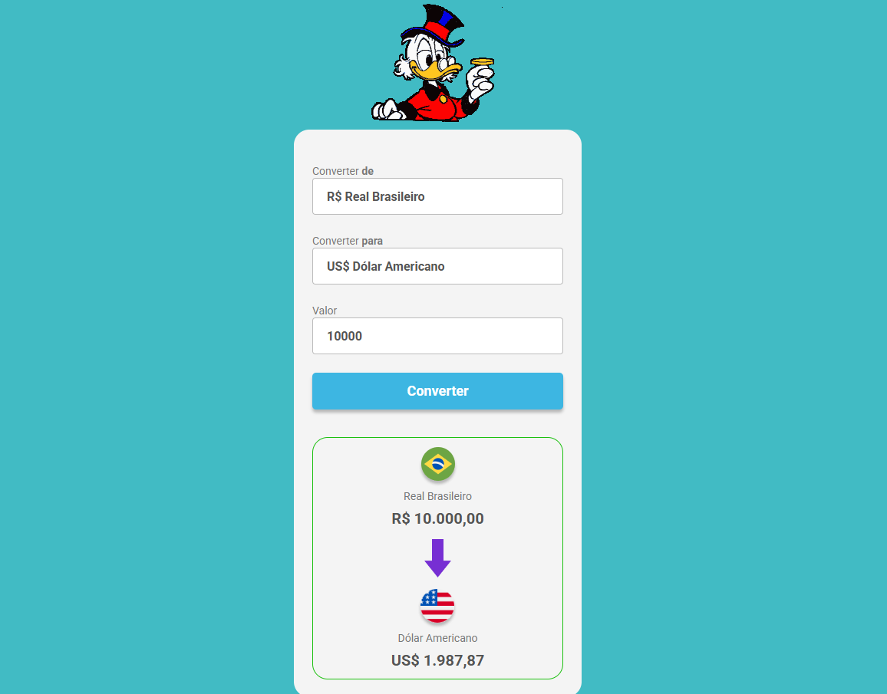

# 💱 Convert Money

Conversor de moedas com cotações em tempo real, desenvolvido com HTML, CSS e JavaScript puro.



---

## ✨ Funcionalidades

- Conversão entre **Real Brasileiro**, **Dólar Americano**, **Euro** e **Libra Esterlina**
- Cotações em **tempo real** via [ExchangeRate-API Open Access](https://www.exchangerate-api.com/docs/free) — sem necessidade de chave de API
- Feedback visual durante a busca da cotação ("Buscando...")
- Formatação de valores no padrão brasileiro com `Intl.NumberFormat`
- Bloqueio automático do botão quando as moedas selecionadas são iguais
- Conversão acionada tanto pelo botão quanto pela tecla **Enter**
- Layout responsivo para dispositivos móveis

---

## 🖥️ Demonstração

> Selecione as moedas, digite o valor e clique em **Converter** — ou pressione Enter.

🔗 Link do projeto: https://eduardoadf-dev.github.io/Conversor_de_moedas/

---

## 🗂️ Estrutura do projeto

```
convert-money/
├── index.html
├── styles.css
├── scripts.js
└── assets/
    ├── tio-patinhas.gif
    ├── Real.png
    ├── Dólar.png
    ├── Euro.png
    ├── Libra.png
    └── Arrow.png
```

---

## 🚀 Como usar

1. Clone o repositório:
   ```bash
   git clone https://github.com/eduardoadf-dev/Conversor_de_moedas.git
   ```

2. Acesse a pasta:
   ```bash
   cd Conversor_de_moedas
   ```

3. Abra o `index.html` diretamente no navegador — não precisa de servidor ou instalação.

> O projeto usa a API Open Access da ExchangeRate-API, que não exige cadastro nem chave de API. Apenas uma conexão com a internet é necessária para buscar as cotações.

---

## 🔌 API utilizada

| Propriedade | Detalhe |
|---|---|
| Serviço | [ExchangeRate-API — Open Access](https://www.exchangerate-api.com/docs/free) |
| Autenticação | Nenhuma (sem chave de API) |
| Atualização | 1 vez por dia |
| Endpoint usado | `https://open.er-api.com/v6/latest/{moeda_base}` |

**Exemplo de requisição:**
```
GET https://open.er-api.com/v6/latest/BRL
```

**Exemplo de resposta:**
```json
{
  "result": "success",
  "base_code": "BRL",
  "rates": {
    "USD": 0.19,
    "EUR": 0.17,
    "GBP": 0.15
  }
}
```

---

## 🛠️ Tecnologias

- **HTML5** — estrutura semântica
- **CSS3** — estilização e responsividade
- **JavaScript (ES6+)** — lógica, `async/await`, `fetch` e `Intl.NumberFormat`
- **Google Fonts** — família Roboto

---

## 📚 Conceitos praticados

- Consumo de API REST com `fetch`
- Programação assíncrona com `async/await`
- Tratamento de erros com `try/catch/finally`
- Manipulação do DOM
- Formatação de moedas com a API nativa `Intl.NumberFormat`

---

## 📱 Responsividade

O layout se adapta a telas menores que 500px, tornando o app utilizável em dispositivos móveis.

---

## 📄 Licença

Este projeto está sob a licença MIT. Consulte o arquivo [LICENSE](./LICENSE) para mais detalhes.

---

<p align="center">
  Desenvolvido por <strong>DuDev</strong>
</p>
